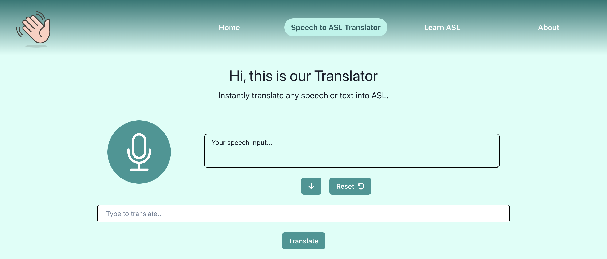

# Welcome to Talk to the Hand

### HenHacks 2024 - 1st place LabWare Connections Hack

## Inspiration

Our inspiration initially came from a TikTok we saw about a deaf woman who was upset that people expected her to read their lips while they talked to her. They didn't realize how difficult it was for her to do so. When it came time for this hackathon, we did some more research and realized that popular language-learning platforms like Duolingo and Babbel don’t support ASL learning. In addition, existing translators translate letter-by-letter instead of word-by-word.

## What it does

Talk to the Hand is a website that has a live text-to-ASL feature that translates speech / text to ASL and a learning ASL feature for people who want to learn ASL. Two qualities we focused on were accessibility and connectivity. Our website helps the deaf and hearing impaired communities connect with others and vice versa.

## How we built it

We used React, TypeScript, and Chakra-UI / HTML & CSS in order to build our website. We used GitHub to collaborate and share the progress in our code. We also expanded our skillset by using multiple libraries:

- react-speech-recognition for speech-to-text conversion
- react-visibility-sensor for animations on scroll
- react-card-flip for flashcard animations

## Challenges we faced

**UI Challenges:**
One of the challenges we ran into was getting the ASL translator to convert from speech or text within the same text box. We decided to prioritize the overall functionality of the website, so we worked around the issue by making the convert from speech a separate area from the text.

**State:** Another issue we ran into was figuring out how to change state with react/typescript and modifying arrays without crashing the website.

## Accomplishments we're proud of

We are proud of our live text-to-ASL feature that translates speech / text to ASL. We used the react-speech-recognition library and a growing dictionary of ASL images to make this possible.

## What we learned

We learned several things while working on this project including: how to effectively incorporate react libraries into our program, efficiently split work amongst ourselves to focus on our strengths, and make the user experience more accessible. We also learned how to use animations and transitions, and how to design a clean layout to make our website design more aesthetically pleasing. Along the way, we also picked up a little ASL.

## What's next for Talk to the Hand

Our current dataset of word signs is very limited, so we would like to add more commonly used words to the dataset. We also recognize that the sentence structure in ASL varies from that of English, so we would like to update our algorithm to reflect that. In the future, we would like to add more to the learning hub by expanding each lesson set and possibly including a quiz mode.

## Try it out:

https://beniabra.github.io/TalkToTheHand/

**Presentation:** https://docs.google.com/presentation/d/1zDCt94RDffHJoVHgXLMQRJPvSCBvhWJGtKIA16B-YFg/edit#slide=id.g10b687a8bd6_0_596

**Demo Video:** https://youtu.be/x2z2PumxJbA

**Devpost:** https://devpost.com/software/talk-to-the-hand-0csw56
